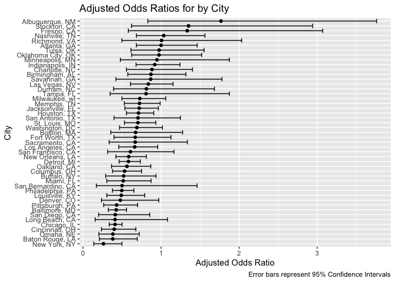
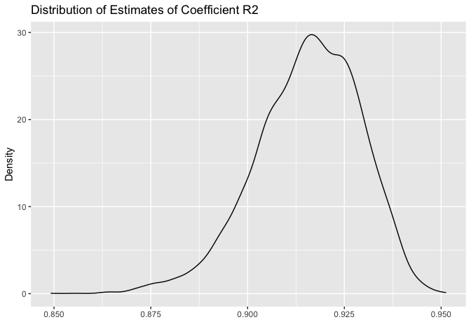
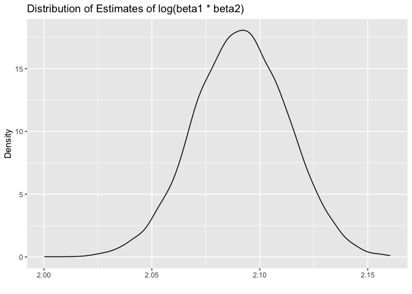
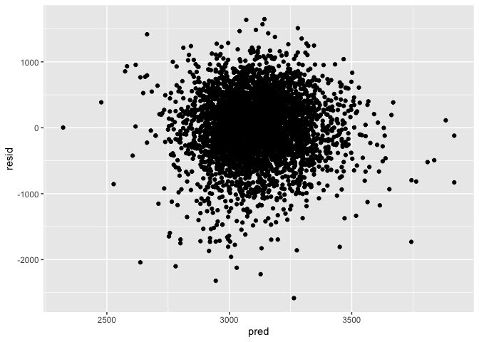
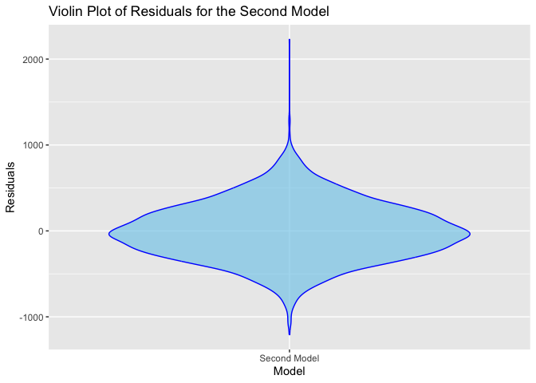
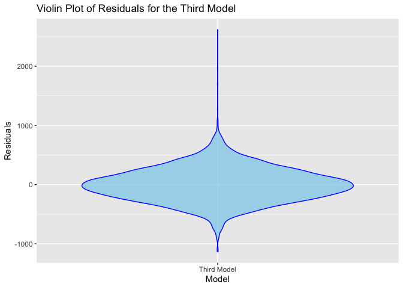
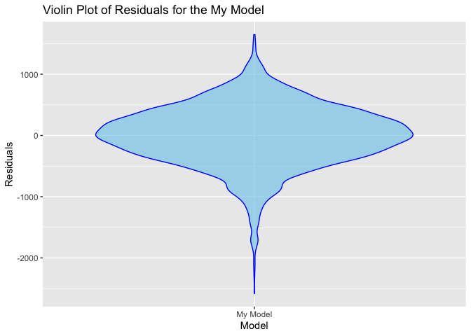
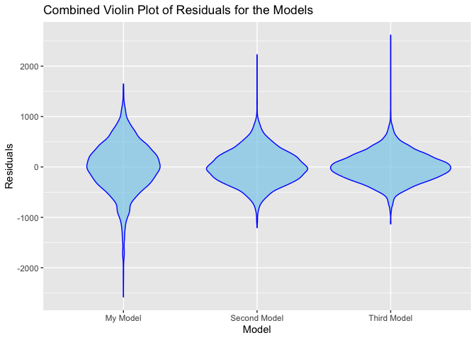
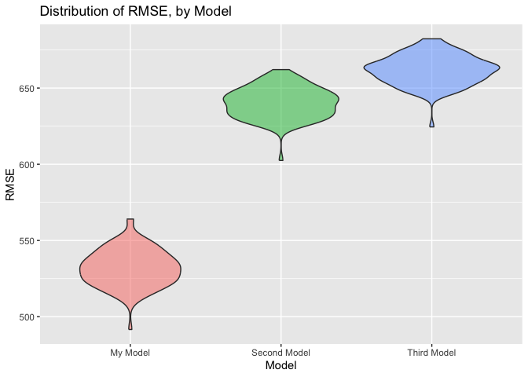

p8105_hw6_xh2636
================
Xiaoyu Huang
2023-11-27

``` r
library(tidyverse)
```

    ## ── Attaching core tidyverse packages ──────────────────────── tidyverse 2.0.0 ──
    ## ✔ dplyr     1.1.3     ✔ readr     2.1.4
    ## ✔ forcats   1.0.0     ✔ stringr   1.5.0
    ## ✔ ggplot2   3.4.3     ✔ tibble    3.2.1
    ## ✔ lubridate 1.9.2     ✔ tidyr     1.3.0
    ## ✔ purrr     1.0.2     
    ## ── Conflicts ────────────────────────────────────────── tidyverse_conflicts() ──
    ## ✖ dplyr::filter() masks stats::filter()
    ## ✖ dplyr::lag()    masks stats::lag()
    ## ℹ Use the conflicted package (<http://conflicted.r-lib.org/>) to force all conflicts to become errors

``` r
library(ggplot2)
library(modelr)
library(mgcv)
```

    ## Loading required package: nlme
    ## 
    ## Attaching package: 'nlme'
    ## 
    ## The following object is masked from 'package:dplyr':
    ## 
    ##     collapse
    ## 
    ## This is mgcv 1.9-0. For overview type 'help("mgcv-package")'.

``` r
library(dplyr)
library(readxl)
library(broom)
```

    ## 
    ## Attaching package: 'broom'
    ## 
    ## The following object is masked from 'package:modelr':
    ## 
    ##     bootstrap

``` r
library(purrr)
library(Metrics)
```

    ## 
    ## Attaching package: 'Metrics'
    ## 
    ## The following objects are masked from 'package:modelr':
    ## 
    ##     mae, mape, mse, rmse

# Problem 1

``` r
# Load the raw data
path <- "https://raw.githubusercontent.com/washingtonpost/data-homicides/master/homicide-data.csv"

homicide_data <- read.csv(path)

# Adding the city state variable
homicide_data <- homicide_data %>%
  mutate(city_state = paste(city, state, sep = ", "))

# Adding the binary variable indicating whether the homicide is solved
homicide_data <- homicide_data %>%
  mutate(resolved = as.numeric(disposition == "Closed by arrest"))

homicide_data <- homicide_data %>%
  mutate(victim_age = as.numeric(victim_age))

# Omit cities Dallas, TX; Phoenix, AZ; and Kansas City, MO; Tulsa, AL
homicide_data <- homicide_data %>%
  filter(!(city_state %in% c('Dallas, TX', 
                             'Phoenix, AZ', 'Kansas City, MO', 'Tulsa, AL')))

homicide_data <- homicide_data %>%
  filter(victim_race %in% c("White", "Black"))

view(homicide_data)
```

``` r
# use the glm function to fit a logistic regression with resolved vs unresolved
baltimore <- filter(homicide_data, city == 'Baltimore' & state == 'MD')

model <- glm(resolved ~ victim_age + victim_race + victim_sex,
    data = baltimore,
    family = binomial()) 

# apply the broom::tidy to this object
model %>% 
  broom::tidy() %>%
  mutate(
    adjusted_OR = exp(estimate),
    CI_lower = exp(estimate - 1.96 * std.error),
    CI_upper = exp(estimate + 1.96 * std.error)
  ) %>% 
  select(term, adjusted_OR, CI_lower, CI_upper) %>% 
  knitr::kable(digits = 3)
```

| term             | adjusted_OR | CI_lower | CI_upper |
|:-----------------|------------:|---------:|---------:|
| (Intercept)      |       1.363 |    0.975 |    1.907 |
| victim_age       |       0.993 |    0.987 |    1.000 |
| victim_raceWhite |       2.320 |    1.648 |    3.268 |
| victim_sexMale   |       0.426 |    0.325 |    0.558 |

``` r
# run glm for each of the cities in your dataset, and extract the adjusted odds ratio
city_model <- homicide_data %>% 
  nest(data = -city_state) %>%
  mutate(
    fit = map(.x = data, ~ glm(resolved ~ victim_age + victim_sex + victim_race, data = ., family = binomial())),
    output = map(fit, broom::tidy)
  ) %>%
  unnest(cols = output) %>%
  filter(term == "victim_sexMale") %>%
  mutate(adjusted_OR = exp(estimate),
         CI_lower = exp(estimate - 1.96 * std.error),
         CI_upper = exp(estimate + 1.96 * std.error)) %>%
  select(city_state, adjusted_OR, CI_lower, CI_upper) 

# Plot the graph
city_model %>%
  mutate(city_state = fct_reorder(city_state, adjusted_OR)) %>%
  ggplot(aes(x = city_state, y = adjusted_OR, ymin = CI_lower, ymax = CI_upper)) +
  geom_point() + 
  geom_errorbar() +
  coord_flip() +
  theme(legend.position = "none") +
  labs(
    title = "Adjusted Odds Ratios for by City",
    x = "City",
    y = "Adjusted Odds Ratio",
    caption = "Error bars represent 95% Confidence Intervals"
  )
```

<!-- -->

# Problem 2

``` r
weather_df = 
  rnoaa::meteo_pull_monitors(
    c("USW00094728"),
    var = c("PRCP", "TMIN", "TMAX"), 
    date_min = "2022-01-01",
    date_max = "2022-12-31") |>
  mutate(
    name = recode(id, USW00094728 = "CentralPark_NY"),
    tmin = tmin / 10,
    tmax = tmax / 10) |>
  select(name, id, everything())
```

    ## using cached file: /Users/xiaoyuhuang/Library/Caches/org.R-project.R/R/rnoaa/noaa_ghcnd/USW00094728.dly

    ## date created (size, mb): 2023-09-17 21:46:16.475257 (8.524)

    ## file min/max dates: 1869-01-01 / 2023-09-30

``` r
view(weather_df)
```

``` r
# Use 5000 bootstrap samples and produce estimates of these two quantities. 
set.seed(1)

bootstrap_result <- weather_df %>%
  modelr::bootstrap(n = 5000) %>%
  mutate(
      models         = map(strap, ~lm(tmax ~ tmin, data = .x) )
    , results_tidy   = map(models, broom::tidy)
    , results_glance = map(models, broom::glance)
  ) %>% 
  select(-strap, -models)

view(bootstrap_result)
```

``` r
# R2
r2_appro <-
  bootstrap_result %>%
  select(-results_tidy) %>%
  unnest(results_glance) %>%
  select(.id, r.squared)

# Plot the distribution of your estimates of R2
r2_appro %>%
  ggplot(aes(x = r.squared)) + geom_density() +
  labs(
    title = "Distribution of Estimates of Coefficient R2"
    , x = ""
    , y = "Density"
  )
```

<!-- -->

``` r
# 95% confidence interval for R2
quantiles_r2 <- quantile(r2_appro$r.squared, c(0.025, 0.975), na.rm = TRUE)
quantiles_r2
```

    ##      2.5%     97.5% 
    ## 0.8861342 0.9382599

As we can see from the result, The 95% confidence interval around the
estimate of R2 is given by \[0.8861, 0.9383\]. The graph shows like a
normal distribution, but a appreance left skewed also.

``` r
# Log
log_appro <-
  bootstrap_result %>%
  select(-results_glance) %>%
  unnest(results_tidy) %>%
  select(.id, term, estimate) %>%
  mutate(
    term = ifelse(term == "(Intercept)", "b1", ifelse(term == "tmin", "b2", term))
  ) %>%
  pivot_wider(
      names_from  = term
    , values_from = estimate
  ) %>%
 transmute(log_prod = log(b1 * b2))

# create a density plot of the distribution of our estimates
log_appro %>%
  ggplot(aes(x = log_prod)) + geom_density() +
  labs(
    title = "Distribution of Estimates of log(beta1 * beta2)"
    , x = ""
    , y = "Density"
  )
```

<!-- -->

``` r
# 95% confidence interval for R2
quantiles_log <- quantile(log_appro$log_prod, c(0.025, 0.975), na.rm = TRUE)
quantiles_log
```

    ##     2.5%    97.5% 
    ## 2.048842 2.133321

As we can see from the result, The 95% confidence interval around the
estimate of R2 is given by \[2.049, 2.133\]. The graph shows like a
normal distribution, but a little left skewed.

# Problem 3

``` r
# Load and clean the data for regression analysis convert numeric to factor
brithweight <- read.csv("./data/birthweight.csv") %>%
  janitor::clean_names() %>%
  mutate(babysex = factor(babysex, levels = c(1, 2), 
                     labels = c("Male", "Female")),
    frace = factor(frace, levels = c(1, 2, 3, 4, 8, 9), 
                   labels = c("White", "Black", "Asian", 
                              "Puerto Rican", "Other", "Unknown")),
    mrace = factor(mrace, levels = c(1, 2, 3, 4, 8), 
                   labels = c("White", "Black", "Asian", "Puerto Rican", "Other")),
    malform = factor(malform, levels = c(0, 1), labels = c("Absent", "Present")))
```

``` r
# Checking for missing value
sum(is.na(brithweight))
```

    ## [1] 0

``` r
# Find my model
check_all_variable =  lm(bwt ~ babysex + fincome + 
                        blength + gaweeks + momage + 
                        parity + ppwt + wtgain + smoken, data = brithweight)

check_all_variable %>% broom::tidy() %>% knitr::kable(digits = 3)
```

| term          |  estimate | std.error | statistic | p.value |
|:--------------|----------:|----------:|----------:|--------:|
| (Intercept)   | -4384.855 |    98.687 |   -44.432 |   0.000 |
| babysexFemale |   -17.666 |     9.875 |    -1.789 |   0.074 |
| fincome       |     1.500 |     0.200 |     7.501 |   0.000 |
| blength       |   120.549 |     1.996 |    60.407 |   0.000 |
| gaweeks       |    24.595 |     1.690 |    14.552 |   0.000 |
| momage        |     5.870 |     1.359 |     4.318 |   0.000 |
| parity        |   118.947 |    47.831 |     2.487 |   0.013 |
| ppwt          |     2.049 |     0.248 |     8.248 |   0.000 |
| wtgain        |     5.340 |     0.463 |    11.538 |   0.000 |
| smoken        |    -3.796 |     0.668 |    -5.685 |   0.000 |

``` r
# Make sure the own model
my_model = lm(bwt ~ fincome + wtgain, data = brithweight)

my_model %>% broom::tidy() %>% knitr::kable(digits = 3)
```

| term        | estimate | std.error | statistic | p.value |
|:------------|---------:|----------:|----------:|--------:|
| (Intercept) | 2718.385 |    21.107 |   128.793 |       0 |
| fincome     |    3.127 |     0.286 |    10.926 |       0 |
| wtgain      |   11.689 |     0.679 |    17.211 |       0 |

``` r
# add_predictions and add_residuals
brithweight %>% 
  add_predictions(my_model) %>%
  add_residuals(my_model) %>% 
  ggplot(aes(x = pred, y = resid)) +
  geom_point()
```

<!-- -->
After we obtained the scientific data for all variables, I selected a
few variables that could be used as templates for analysis. These values
were then plotted. We can see that the deviation is not much. Although
some points are still far away from the center line, they are still
within the acceptable range.

``` r
# Compare the model for second model
second_model = lm(bwt ~ bhead + gaweeks, data = brithweight)

residuals_second <- residuals(second_model)

second_model <- data.frame(Model = rep("Second Model", length(residuals_second)), Residuals = residuals_second)

# Plot the violin plot for model 2
ggplot(second_model, aes(x = Model, y = Residuals)) +
  geom_violin(fill = "skyblue", color = "blue", alpha = 0.7) +
  labs(
    title = "Violin Plot of Residuals for the Second Model",
    x = "Model",
    y = "Residuals"
  )
```

<!-- -->

``` r
# Compare the model for third model
Third_model = lm(bwt ~ bhead*blength*babysex, data = brithweight)

residuals_third <- residuals(Third_model)

Third_model <- data.frame(Model = rep("Third Model", length(residuals_third)), Residuals = residuals_third)

# Plot the violin plot for model 3
ggplot(Third_model, aes(x = Model, y = Residuals)) +
  geom_violin(fill = "skyblue", color = "blue", alpha = 0.7) +
  labs(
    title = "Violin Plot of Residuals for the Third Model",
    x = "Model",
    y = "Residuals"
  )
```

<!-- -->

``` r
# Compare the model for my model
my_model = lm(bwt ~ fincome + wtgain, data = brithweight)

residuals_my <- residuals(my_model)

my_model <- data.frame(Model = rep("My Model", length(residuals_third)), Residuals = residuals_my)

# Plot the violin plot for model 3
ggplot(my_model, aes(x = Model, y = Residuals)) +
  geom_violin(fill = "skyblue", color = "blue", alpha = 0.7) +
  labs(
    title = "Violin Plot of Residuals for the My Model",
    x = "Model",
    y = "Residuals"
  )
```

<!-- -->

``` r
# Combine all the violin
second_model <- lm(bwt ~ bhead + gaweeks, data = brithweight)
Third_model <- lm(bwt ~ bhead * blength * babysex, data = brithweight)
my_model <- lm(bwt ~ fincome + wtgain, data = brithweight)

residuals_second <- data.frame(Model = rep("Second Model", length(residuals(second_model))), Residuals = residuals(second_model))
residuals_third <- data.frame(Model = rep("Third Model", length(residuals(Third_model))), Residuals = residuals(Third_model))
residuals_my <- data.frame(Model = rep("My Model", length(residuals(my_model))), Residuals = residuals(my_model))

# Create a combined data frame
combined_data <- rbind(residuals_second, residuals_third, residuals_my)

# Plot the combined violin plot
ggplot(combined_data, aes(x = Model, y = Residuals)) +
  geom_violin(fill = "skyblue", color = "blue", alpha = 0.7) +
  labs(
    title = "Combined Violin Plot of Residuals for the Models",
    x = "Model",
    y = "Residuals"
  )
```

<!-- -->

``` r
# Define models this time we add the crossv_mc function
my_model <- lm(bwt ~ fincome + wtgain, data = brithweight)
second_model <- lm(bwt ~ bhead + gaweeks, data = brithweight)
third_model <- lm(bwt ~ bhead * blength * babysex, data = brithweight)

# Cross-validation setup
cv_split <- crossv_mc(brithweight, 100) %>% 
  mutate(
    train = map(train, as_tibble),
    test  = map(test,  as_tibble)
  )

# Fit models to training data
rmse_df <- cv_split %>%
  mutate(
    my    = map(.x = train, ~ predict(my_model, newdata = .)),
    second = map(.x = train, ~ predict(second_model, newdata = .)),
    third  = map(.x = train, ~ predict(third_model, newdata = .))
  ) %>%

  # Apply fitted models to testing data for validation
  mutate(
    rmse_my    = map2_dbl(.x = my,    .y = test, ~ rmse(.x, .y$bwt)),
    rmse_second  = map2_dbl(.x = second,  .y = test, ~ rmse(.x, .y$bwt)),
    rmse_third  = map2_dbl(.x = third,  .y = test, ~ rmse(.x, .y$bwt))
  ) %>%
  select(rmse_my, rmse_second, rmse_third) %>%
  pivot_longer(
    cols         = everything(),
    names_to     = "model",
    values_to    = "rmse",
    names_prefix = "rmse_"
  ) %>%

# Factorize models to preserve ordering
  mutate(model = fct_inorder(model))

# Plotting
rmse_df %>%
  ggplot(aes(x = model, y = rmse, fill = model)) +
  geom_violin(alpha = 0.5) +
  theme(legend.position = "none") +
  labs(
    title = "Distribution of RMSE, by Model",
    x     = "Model",
    y     = "RMSE"
  ) +
  scale_x_discrete(labels = c(
    "My Model",
    "Second Model",
    "Third Model"
  ))
```

<!-- -->
When these three models are arranged together, we can see that there is
not much difference between our model and the other two.
