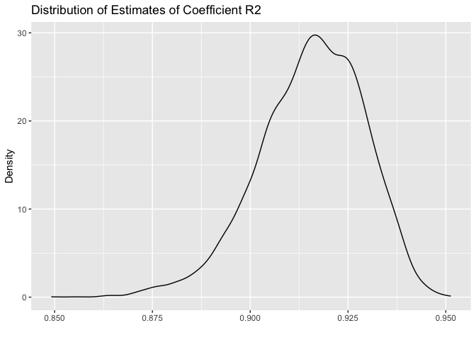
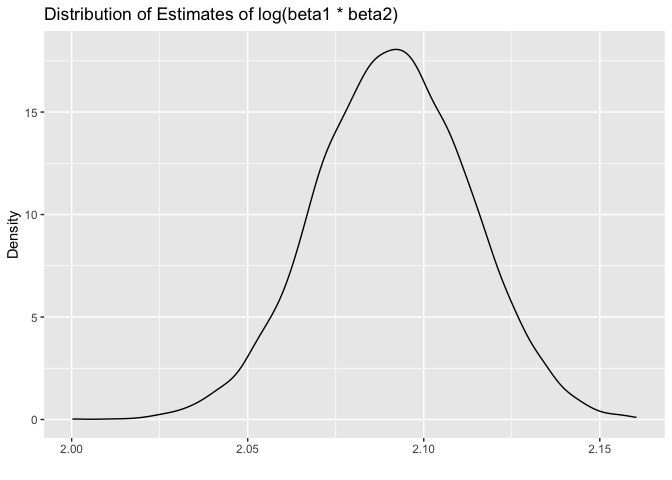

p8105_hw6_xh2636
================
Xiaoyu Huang
2023-11-27

``` r
library(tidyverse)
```

    ## ── Attaching core tidyverse packages ──────────────────────── tidyverse 2.0.0 ──
    ## ✔ dplyr     1.1.3     ✔ readr     2.1.4
    ## ✔ forcats   1.0.0     ✔ stringr   1.5.0
    ## ✔ ggplot2   3.4.3     ✔ tibble    3.2.1
    ## ✔ lubridate 1.9.2     ✔ tidyr     1.3.0
    ## ✔ purrr     1.0.2     
    ## ── Conflicts ────────────────────────────────────────── tidyverse_conflicts() ──
    ## ✖ dplyr::filter() masks stats::filter()
    ## ✖ dplyr::lag()    masks stats::lag()
    ## ℹ Use the conflicted package (<http://conflicted.r-lib.org/>) to force all conflicts to become errors

``` r
library(ggplot2)
library(modelr)
library(mgcv)
```

    ## Loading required package: nlme
    ## 
    ## Attaching package: 'nlme'
    ## 
    ## The following object is masked from 'package:dplyr':
    ## 
    ##     collapse
    ## 
    ## This is mgcv 1.9-0. For overview type 'help("mgcv-package")'.

``` r
library(dplyr)
library(readxl)
library(broom)
```

    ## 
    ## Attaching package: 'broom'
    ## 
    ## The following object is masked from 'package:modelr':
    ## 
    ##     bootstrap

``` r
library(purrr)
```

# Problem 1

``` r
# Load the raw data
path <- "https://raw.githubusercontent.com/washingtonpost/data-homicides/master/homicide-data.csv"

homicide_data <- read.csv(path)

# Adding the city state variable
homicide_data <- homicide_data %>%
  mutate(city_state = paste(city, state, sep = ", "))

# Adding the binary variable indicating whether the homicide is solved
homicide_data <- homicide_data %>%
  mutate(resolved = as.numeric(disposition == "Closed by arrest"))

homicide_data <- homicide_data %>%
  mutate(victim_age = as.numeric(victim_age))

# Omit cities Dallas, TX; Phoenix, AZ; and Kansas City, MO; Tulsa, AL
homicide_data <- homicide_data %>%
  filter(!(city_state %in% c('Dallas, TX', 
                             'Phoenix, AZ', 'Kansas City, MO', 'Tulsa, AL')))

# Focus on the race only in White and Black
homicide_data <- homicide_data %>%
   mutate(victim_race = fct_relevel(victim_race, "White", "Black"),
         victim_sex = fct_relevel(victim_sex, "Male", "Female"))

view(homicide_data)
```

``` r
# use the glm function to fit a logistic regression with resolved vs unresolved
homicide_data <- homicide_data %>%
  mutate(victim_race = fct_relevel(victim_race, "White", "Black"),
         victim_sex = fct_relevel(victim_sex, "Male", "Female"))

baltimore <- filter(homicide_data, city == 'Baltimore' & state == 'MD')

baltimore <- baltimore %>%
  mutate(victim_raceWhite = as.integer(victim_race == "White"),
         victim_raceBlack = as.integer(victim_race == "Black"),
         victim_sexMale = as.integer(victim_sex == "Male"),
         victim_sexFemale = as.integer(victim_sex == "Female"))

model <- glm(resolved ~ victim_age + 
               victim_sexMale + victim_sexFemale + victim_raceWhite + victim_raceBlack, 
             data = baltimore, 
             family = binomial())

# apply the broom::tidy to this object
model %>% 
  broom::tidy() %>%
  mutate(OR = exp(estimate)) %>%
  select(term, log_OR = estimate, OR, p.value) %>%
  knitr::kable(digits = 3)
```

| term             | log_OR |    OR | p.value |
|:-----------------|-------:|------:|--------:|
| (Intercept)      |  0.967 | 2.631 |   0.001 |
| victim_age       | -0.007 | 0.993 |   0.028 |
| victim_sexMale   | -0.884 | 0.413 |   0.000 |
| victim_sexFemale |     NA |    NA |      NA |
| victim_raceWhite |  0.224 | 1.251 |   0.439 |
| victim_raceBlack | -0.617 | 0.540 |   0.010 |

``` r
tidy_model <- broom::tidy(model)

adjusted_odds_ratio <- tidy_model %>%
  mutate(OR = exp(estimate)) %>%
  filter(term %in% c('victim_raceWhite', 'victim_raceBlack', 'victim_sexMale', 'victim_sexFemale'))


print(adjusted_odds_ratio)
```

    ## # A tibble: 4 × 6
    ##   term             estimate std.error statistic   p.value     OR
    ##   <chr>               <dbl>     <dbl>     <dbl>     <dbl>  <dbl>
    ## 1 victim_sexMale     -0.884     0.136    -6.49   8.68e-11  0.413
    ## 2 victim_sexFemale   NA        NA        NA     NA        NA    
    ## 3 victim_raceWhite    0.224     0.289     0.774  4.39e- 1  1.25 
    ## 4 victim_raceBlack   -0.617     0.239    -2.58   9.88e- 3  0.540

# Problem 2

``` r
weather_df = 
  rnoaa::meteo_pull_monitors(
    c("USW00094728"),
    var = c("PRCP", "TMIN", "TMAX"), 
    date_min = "2022-01-01",
    date_max = "2022-12-31") |>
  mutate(
    name = recode(id, USW00094728 = "CentralPark_NY"),
    tmin = tmin / 10,
    tmax = tmax / 10) |>
  select(name, id, everything())
```

    ## using cached file: /Users/xiaoyuhuang/Library/Caches/org.R-project.R/R/rnoaa/noaa_ghcnd/USW00094728.dly

    ## date created (size, mb): 2023-09-17 21:46:16.475257 (8.524)

    ## file min/max dates: 1869-01-01 / 2023-09-30

``` r
view(weather_df)
```

``` r
# Use 5000 bootstrap samples and produce estimates of these two quantities. 
set.seed(1)

bootstrap_result <- weather_df %>%
  modelr::bootstrap(n = 5000) %>%
  mutate(
      models         = map(strap, ~lm(tmax ~ tmin, data = .x) )
    , results_tidy   = map(models, broom::tidy)
    , results_glance = map(models, broom::glance)
  ) %>% 
  select(-strap, -models)

view(bootstrap_result)
```

``` r
# R2
r2_appro <-
  bootstrap_result %>%
  select(-results_tidy) %>%
  unnest(results_glance) %>%
  select(.id, r.squared)

# Plot the distribution of your estimates of R2
r2_appro %>%
  ggplot(aes(x = r.squared)) + geom_density() +
  labs(
    title = "Distribution of Estimates of Coefficient R2"
    , x = ""
    , y = "Density"
  )
```

<!-- -->

``` r
# 95% confidence interval for R2
quantiles_r2 <- quantile(r2_appro$r.squared, c(0.025, 0.975), na.rm = TRUE)
quantiles_r2
```

    ##      2.5%     97.5% 
    ## 0.8861342 0.9382599

``` r
mean_r2 <- mean(r2_appro$r.squared, na.rm = TRUE)
sd_r2 <- sd(r2_appro$r.squared, na.rm = TRUE)
```

As we can see from the result, The 95% confidence interval around the
estimate of R2 is given by \[0.8861, 0.9383\]. The graph shows like a
normal distribution, but left skewed also. The mean is 0.915576and the
standard deviation is 0.0134792.

``` r
# Log
log_appro <-
  bootstrap_result %>%
  select(-results_glance) %>%
  unnest(results_tidy) %>%
  select(.id, term, estimate) %>%
  mutate(
    term = ifelse(term == "(Intercept)", "b1", ifelse(term == "tmin", "b2", term))
  ) %>%
  pivot_wider(
      names_from  = term
    , values_from = estimate
  ) %>%
 mutate(log_prod = log(b1 * b2))

# create a density plot of the distribution of our estimates
log_appro %>%
  ggplot(aes(x = log_prod)) + geom_density() +
  labs(
    title = "Distribution of Estimates of log(beta1 * beta2)"
    , x = ""
    , y = "Density"
  )
```

<!-- -->

``` r
# 95% confidence interval for R2
quantiles_log <- quantile(log_appro$log_prod, c(0.025, 0.975), na.rm = TRUE)
quantiles_log
```

    ##     2.5%    97.5% 
    ## 2.048842 2.133321

``` r
mean_log <- mean(log_appro$log_prod, na.rm = TRUE)
sd_log <- sd(log_appro$log_prod, na.rm = TRUE)
```

As we can see from the result, The 95% confidence interval around the
estimate of R2 is given by \[2.049, 2.133\]. The graph shows like a
normal distribution, but a little left skewed. The mean is 2.0911857and
the standard deviation is 0.0216813.
